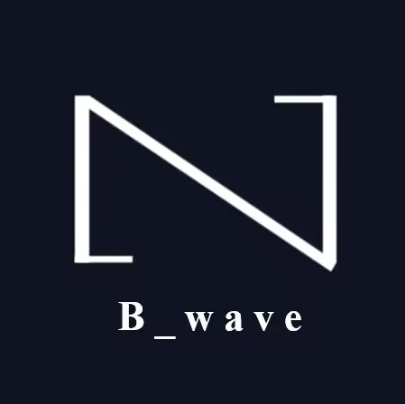

# 音频BPM分类器



一个基于深度学习的音频节奏速度（BPM）分类系统，支持音乐文件自动分类和BPM测量。

## 功能特性

- 🎵 支持WAV/MP3音频格式处理
- 🧠 基于CNN的BPM分类模型
- ⚡ 实时BPM估算功能
- 📦 模型导出为SavedModel/TFLite格式
- 📊 训练过程可视化支持
- 🔄 数据增强（时间拉伸/音高变换）

## 快速开始

### 环境要求

- Python 3.11+
- CUDA 11.8 (GPU加速推荐)
- cuDNN 8.6

### 安装

```bash
git clone https://github.com/liescake/audio-bpm-classifier.git
cd audio-bpm-classifier
```

# 创建虚拟环境

conda create -n bpm_classifier python=3.11
conda activate bpm_classifier

# 安装依赖

pip install -r requirements.txt

# 数据集结构

dataset/
├── 60-100/
│   ├── track1.wav
│   └── ...
├── 100-120/
└── 120-140/

# 使用方法

训练模型

```bash
python main.py --data_dir ./dataset --config config.ini
```

### 单文件预测

```bash
python main.py --predict test.wav
```

### 批量BPM测量

```bash
python main.py --predict test.wav
```

## 项目结构

.
├── config.ini               # 配置文件
├── main.py                  # 主程序入口
├── data_preparation.py      # 数据加载与处理
├── module_preparation.py    # 模型架构定义
├── training.py              # 训练流程控制
├── saving.py                # 模型导出功能
├── bpm_measurement.py       # BPM测量工具
└── app.py                   # Flask API服务

## 模型导出

导出训练好的模型为不同格式：

导出为SavedModel

```bash
python saving.py --format saved_model
```

转换为TFLite 

```bash
python saving.py --format tflite
```

## 依赖项

- TensorFlow 2.13.0

- Librosa 0.10.1

- NumPy 1.24.3

- Scikit-learn 1.3.0

- Pydub 0.25.1

完整列表见 [requirements.txt](https://requirements.txt/)


## 贡献指南

欢迎提交Issue和PR！


## 许可证

[MIT License](https://license/)


By Liescake
